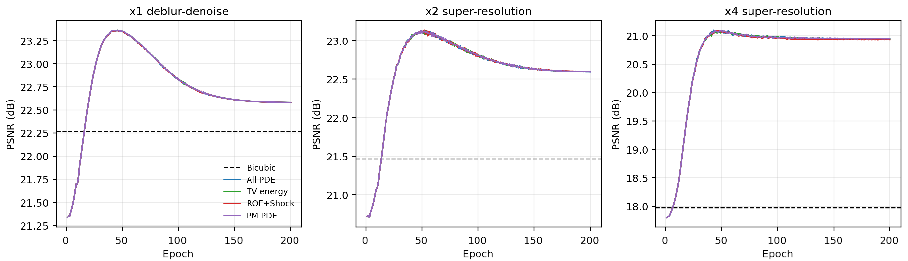

# Inverse PINN for Blind Image Restoration and Super-Resolution

This repository implements a blind inverse-imaging pipeline built around an implicit neural image representation, a learnable forward degradation model, and PDE-inspired regularization. The main use case is to reconstruct a high-resolution image from a single degraded observation while jointly estimating unknown blur and heterogeneous noise.

The current experiments focus on three synthetic benchmark settings:

- `x1_deblur_denoise`: blind deblurring + denoising
- `x2_sr`: blind 2x super-resolution
- `x4_sr`: blind 4x super-resolution

The core idea is simple: represent the unknown HR image with a coordinate MLP, pass it through a learnable blur+downsample operator, compare the prediction to the observed LR image, and regularize the reconstruction with trainable PDE priors.

## Repository Layout

```text
.
|-- main.py
|-- benchmark_multiscale.py
|-- benchmark_multiscale_stabilized.py
|-- inverse_sr/
|   |-- pinn.py
|   |-- degradation.py
|   |-- priors.py
|   |-- solver.py
|   |-- solver_stabilized.py
|   |-- baselines.py
|   |-- metrics.py
|   `-- io.py
|-- datasets/
|   `-- Set5/Set5_HR/
|-- results/
|   |-- final_inverse_pinn_v1_size256/
|   `-- final_inverse_pinn_v1_size256_stabilized/
`-- denoise_results/
```

## Method

### 1. Inverse problem

Let:

- $u \in [0,1]^{3 \times H \times W}$ be the unknown HR image
- $y \in [0,1]^{3 \times h \times w}$ be the observed degraded image
- $A_{\sigma,s}$ be the unknown forward operator with Gaussian blur width $\sigma$ and downsampling factor $s$

The observation model is

$$
y = A_{\sigma,s}(u) + n,
\qquad
A_{\sigma,s}(u) = S_s(K_{\sigma} * u),
$$

where $K_{\sigma}$ is a Gaussian kernel and $S_s$ is stride downsampling. When $s=1$, the problem reduces to blind deblurring/denoising.

In this codebase the degradation is synthetic and generated in [`inverse_sr/degradation.py`](inverse_sr/degradation.py), while the same operator is re-estimated during inversion.

### 2. PINN-style image parameterization

The unknown image is not optimized pixel-by-pixel. Instead, it is represented by a residual SIREN:

$$
u_{\Theta}(x) = \psi\Big(u_{\text{base}}(x) + \rho \tanh(f_{\Theta}(2x-1))\Big),
\qquad x \in [0,1]^2,
$$

where:

- $u_{\text{base}}$ is the bicubic upsampled observation
- $f_{\Theta}$ is a sinusoidal coordinate network
- $\rho$ is a residual scaling factor
- $\psi(z) = 0.5 + 0.5 \tanh(2(z-0.5))$ softly clamps intensities to $[0,1]$

This is implemented in [`inverse_sr/pinn.py`](inverse_sr/pinn.py) as `ResidualSIREN`.

Strictly speaking, this repository uses a physics-inspired implicit neural representation rather than a time-evolution PINN solver. The "PINN" aspect comes from combining a continuous neural image model with PDE residual terms inside the inverse objective.

### 3. Blind noise model

The residual between observation and predicted LR image is modeled with a trainable mixture of:

- Gaussian noise
- Laplace noise
- signal-dependent speckle-like noise

If $\hat y = A_{\sigma,s}(u_{\Theta})$ and $r_i = y_i - \hat y_i$, the negative log-likelihood is

$$
\mathcal L_{\text{mix}}
=
-\frac{1}{N}\sum_i
\log\Big(
\pi_G e^{-\ell_G(r_i)}
+ \pi_L e^{-\ell_L(r_i)}
+ \pi_S e^{-\ell_S(r_i,\hat y_i)}
\Big),
$$

with component energies

$$
\ell_G(r_i) = \log \sigma_G + \frac{1}{2}\Big(\frac{r_i}{\sigma_G}\Big)^2,
$$

$$
\ell_L(r_i) = \log(2b) + \frac{|r_i|}{b},
$$

$$
\ell_S(r_i,\hat y_i)
=
\log \tau_i + \frac{1}{2}\Big(\frac{r_i}{\tau_i}\Big)^2,
\qquad
\tau_i = \max(\sigma_S |\hat y_i|, 10^{-4}).
$$

The mixture weights $(\pi_G,\pi_L,\pi_S)$ are learned with a softmax parameterization, while $(\sigma_G,b,\sigma_S)$ are constrained to be positive through softplus transforms. This is implemented in [`inverse_sr/solver.py`](inverse_sr/solver.py).

### 4. PDE and variational priors

The reconstruction is regularized with a family of trainable priors:

#### TV

$$
R_{\text{TV}}(u) = \frac{1}{|\Omega|}\sum_{x \in \Omega} |\nabla u(x)|.
$$

#### ROF PDE residual

$$
R_{\text{ROF}}(u)
=
\left\|
\nabla \cdot
\Big(
\frac{\nabla u}{\sqrt{|\nabla u|^2 + \varepsilon^2}}
\Big)
\right\|_2^2.
$$

#### Perona-Malik residual

$$
R_{\text{PM}}(u)
=
\left\|
\nabla \cdot
\big(c(|\nabla u|)\nabla u\big)
\right\|_2^2,
\qquad
c(s) = \frac{1}{1 + s^2/\kappa^2}.
$$

#### Shock-filter residual

Let $\eta = \nabla u / |\nabla u|$ be the local gradient direction and $u_{\eta\eta}$ the second derivative along $\eta$. The implemented residual is

$$
R_{\text{shock}}(u)
=
\left\|
\tanh\Big(\frac{u_{\eta\eta}}{\varepsilon}\Big)
|\nabla u|
\right\|_2^2.
$$

#### Additional common priors

Two extra priors are used in all inverse methods:

- `flat_noise_loss`: penalizes high-frequency content in flat regions
- `edge_sharpness_loss`: rewards strong gradients on edge regions

All prior terms are implemented in [`inverse_sr/priors.py`](inverse_sr/priors.py).

### 5. Joint optimization objective

The solver jointly estimates:

- neural image parameters $\Theta$
- blur width $\sigma$
- noise scales and mixture weights
- prior weights

The objective has the form

$$
\min_{\Theta,\sigma,\xi,\omega}
\mathcal L_{\text{mix}}(A_{\sigma,s}(u_{\Theta}), y)
+ \lambda_{\text{charb}} \mathcal L_{\text{charb}}
+ \sum_j \alpha_j R_j(u_{\Theta})
+ \lambda_{\text{noise}} \mathcal R_{\text{noise}}
+ \lambda_{\text{prior}} \|\omega\|_2^2,
$$

where

$$
\mathcal L_{\text{charb}}
=
\frac{1}{N}\sum_i
\sqrt{(\hat y_i-y_i)^2 + \epsilon^2},
\qquad
\hat y = A_{\sigma,s}(u_{\Theta}),
$$

and the trainable prior weights are parameterized as

$$
\alpha_j = \alpha_j^{(0)} e^{\omega_j}.
$$

In the default solver:

- the prior contribution is warmed up over the first `25%` of training
- the best checkpoint is selected by PSNR on the synthetic HR reference

Important benchmark note: the HR image is used only for evaluation and model selection, not inside the inverse loss itself. This is acceptable for synthetic benchmarking, but it should not be read as a fully reference-free training protocol.

### 6. Stabilized variant

[`inverse_sr/solver_stabilized.py`](inverse_sr/solver_stabilized.py) introduces a more conservative optimization schedule:

- common priors can be down-scaled through `common_prior_scale`
- forward-model parameters and trainable prior weights can be frozen after a warm-up fraction

This variant is used by [`benchmark_multiscale_stabilized.py`](benchmark_multiscale_stabilized.py).

## Implemented Methods

The benchmark compares:

- `Bicubic`
- `All PDE trainable`
- `TV energy`
- `ROF PDE`
- `Perona-Malik PDE`
- `Shock PDE`
- `ROF PDE + Shock`
- `Perona-Malik + Shock`

For inverse methods, the blur parameter, noise mixture, and active prior weights are optimized jointly.

## Installation

Create a Python environment and install the minimal dependencies:

```bash
pip install -r requirements.txt
```

The repository only declares:

- `torch>=2.0`
- `numpy`
- `Pillow`

## Data

The repository already includes Set5 examples under `datasets/Set5/Set5_HR/`. If no image is passed, the code defaults to `butterfly.png` when available.

## Usage

### Single-scale run

```bash
python main.py --image butterfly.png --size 256 --scale 4 --epochs 200 --out results/my_single_run
```

### Multiscale benchmark

```bash
python benchmark_multiscale.py --image butterfly.png --size 256 --epochs 200 --out results/my_multiscale_run
```

### Stabilized multiscale benchmark

```bash
python benchmark_multiscale_stabilized.py --image butterfly.png --size 256 --epochs 200 --common-prior-scale 0.25 --freeze-after-frac 0.25 --out results/my_stabilized_run
```

## Outputs

Each scenario saves:

- `hr.png`
- `lr_clean.png`
- `lr_observed.png`
- one image per method
- `comparison.png`
- `results.md`
- `results.json`

The comparison strips also include zoomed crops and optimization-history plots.

## Results from `results/final_inverse_pinn_v1_size256`

The repository already contains a complete benchmark report at [`results/final_inverse_pinn_v1_size256/benchmark_report.md`](results/final_inverse_pinn_v1_size256/benchmark_report.md). These results were obtained on:

- image: `datasets/Set5/Set5_HR/butterfly.png`
- HR resize: `256 x 256`
- epochs per method: `200`
- device: `cpu`
- true blur sigma: `1.35`
- true noise mixture weights: `(0.45, 0.30, 0.25)`
- true Gaussian std / Laplace scale / speckle std: `0.03 / 0.02 / 0.05`

### Summary table

| Scenario | Bicubic PSNR / SSIM | Best PSNR | Best SSIM | Gain over bicubic |
| --- | --- | --- | --- | --- |
| `x1_deblur_denoise` | `22.27 / 0.6733` | `ROF PDE + Shock` at `23.36 dB` | `TV energy` at `0.7472` | about `+1.09 dB` |
| `x2_sr` | `21.47 / 0.6847` | `All PDE trainable` at `23.10 dB` | `Perona-Malik PDE` at `0.7539` | about `+1.64 dB` |
| `x4_sr` | `17.97 / 0.5629` | `TV energy` at `21.08 dB` | `ROF PDE + Shock` at `0.6746` | about `+3.10 dB` |

### Per-scenario highlights

- `x1_deblur_denoise`: all inverse variants cluster very tightly around `23.35-23.36 dB`, far above bicubic. The best SSIM in the report is `0.7472`, and the learned blur estimate is around `0.715`.
- `x2_sr`: the best PSNR is `23.10 dB` and the best SSIM is `0.7539` with the Perona-Malik PDE configuration. The learned blur estimate is around `0.70`.
- `x4_sr`: this is the hardest case and also the one with the largest improvement. Bicubic reaches `17.97 dB`, while the best inverse model reaches `21.08 dB`; the best SSIM is `0.6746`.

Overall, the hardest upsampling regime (`x4`) benefits the most from the inverse formulation, which is consistent with the fact that bicubic interpolation alone cannot compensate for unknown blur and mixed noise.

### Figures

Qualitative grid:


Convergence summary:



Scenario reports:

- [`x1_deblur_denoise/results.md`](results/final_inverse_pinn_v1_size256/x1_deblur_denoise/results.md)
- [`x2_sr/results.md`](results/final_inverse_pinn_v1_size256/x2_sr/results.md)
- [`x4_sr/results.md`](results/final_inverse_pinn_v1_size256/x4_sr/results.md)

## Experimental Notes

- The synthetic degradation model is known when generating the data but treated as unknown during reconstruction.
- `scale=1` is a deblurring/denoising problem because downsampling becomes the identity.
- The benchmark is fully reproducible from the scripts in the repository, but best-checkpoint selection currently relies on the ground-truth HR image.
- A stabilized variant of the same benchmark is also available in [`results/final_inverse_pinn_v1_size256_stabilized`](results/final_inverse_pinn_v1_size256_stabilized).
